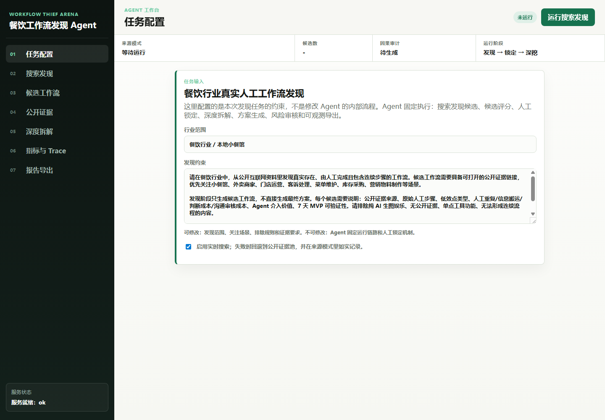
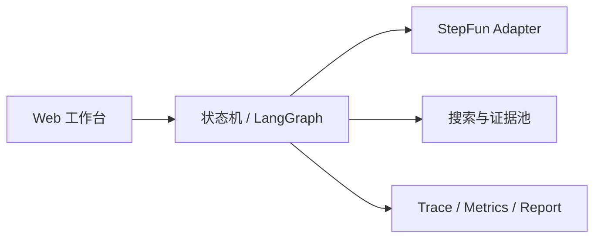

# 视觉营销工作流发现 Agent



先从真实工作中发现值得 Agent 化的流程，再把证据、低效点、介入方案和风险沉淀为可审计报告。它解决的是 Agent 设计之前的机会发现问题，而不只是生成一张营销图。

## 产品亮点

- 从公开证据或内置证据池形成候选工作流，避免凭想象选题。
- 用真实性、流程连续性、低效程度和 Agent 价值统一评分。
- 候选必须经过 Human lock 才能进入深度拆解，业务决策仍由人完成。
- 输出原流程、Agent 流程、风险审查、指标、Trace 和最终报告。
- 实时搜索失败时明确标记 `source_mode`，不把兜底结果伪装成实时数据。

## 技术架构



核心模块位于 `src/restaurant_workflow_discovery/`，同时保留稳定状态机和可选 LangGraph runner。每次运行生成 `run_id`、节点级 Trace、健康状态和模型用量记录。

## 本地运行

要求 Python 3.11–3.13。

```powershell
python -m venv .venv
.\.venv\Scripts\python -m pip install -r requirements-langgraph.txt
.\.venv\Scripts\python -m src.restaurant_workflow_discovery.web_demo
```

打开 `http://127.0.0.1:7860`，健康检查为 `http://127.0.0.1:7860/api/health`。未配置模型时可运行证据驱动的本地降级链路；真实 StepFun 调用需要在进程环境中提供 `STEPFUN_API_KEY`。

## 测试

```powershell
.\.venv\Scripts\python -m unittest discover -s tests -v
```

当前本地结果：12 项测试中 11 项通过，1 项真实模型测试在未配置密钥时跳过。

## 深入阅读

- [产品与技术案例拆解](docs/作品案例拆解.md)
- [演示与运行手册](docs/演示与运行手册.md)

