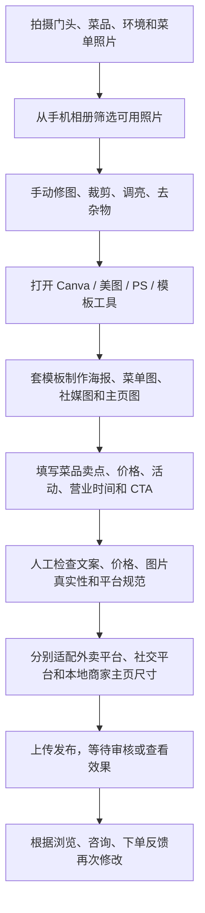
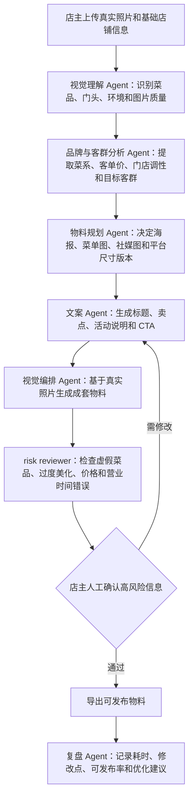

# 餐饮视觉营销助手产品说明文档

## 1. 项目概述

本项目搭建了一个面向餐饮行业的 **Restaurant Workflow Discovery Agent（餐饮工作流发现 Agent）**。它不是单纯的海报生成器，而是先从公开互联网资料中发现真实存在的餐饮人工工作流，抽取公开证据，生成候选工作流，再由人锁定目标流程，最后自动完成流程拆解、低效点分析、Agent 介入设计、产品化方案生成和风险审核。

本次 Agent 最终锁定的真实工作流是：

> **小餐馆视觉营销物料制作与发布工作流**

该工作流描述的是小餐馆老板或门店运营人员，为了提升外卖平台、本地商家主页、社交平台和短视频平台曝光，需要反复完成“拍摄门头、菜品和环境照片 -> 挑选图片 -> 修图裁剪 -> 制作海报、菜单图和店铺图 -> 填写文案与活动信息 -> 适配不同平台 -> 发布前检查 -> 发布后复盘”的人工流程。

基于该工作流，本项目形成的产品方案是：

> **餐饮视觉营销助手**

一句话定位：

> 面向小餐馆老板的视觉营销 Agent，把真实门店照片和活动信息快速转化为可发布、可审核、可复盘的多渠道营销物料。

这个方向具备清晰的 Agent 改造价值：

- **真实存在**：Google Business Profile、DoorDash、Meta 等公开资料都说明餐饮商家需要上传和维护门头、菜品、菜单、服务和营销视觉素材。
- **流程连续**：从素材收集、图片处理、文案生成、版式制作、平台适配、发布审核到效果复盘，形成完整人工链路。
- **低效明显**：店主需要在图片、文案、平台尺寸、活动信息和发布规范之间反复搬运、判断和修改。
- **Agent 介入合理**：Agent 可以承担素材理解、文案生成、尺寸适配、版式规划、发布前审核和复盘建议，但高风险内容仍由店主确认。
- **MVP 可验证**：7 天内可以完成“上传真实照片 + 输入门店信息 + 生成 3 套物料 + 风险审核 + 人工确认 + 导出发布素材”的闭环验证。

## 2. Agent 搭建说明

### 2.1 使用了什么工具

系统采用“公开证据搜索 + 分阶段工作流 + 大模型推理 + 人工锁定 + 风险审核 + 可观测记录”的技术路线。

| 工具或技术 | 作用 | 价值 |
| --- | --- | --- |
| Python 工作流执行 | 组织 Agent 主流程、状态管理、文件导出和本地服务 | 实现轻量、稳定、可复盘的运行链路 |
| LangGraph StateGraph（图式状态编排） | 将同一批业务节点接入图式工作流编排 | 提升 Agent 架构能力，便于扩展多分支和多 Agent 协作 |
| StepFun API | 通过 OpenAI-compatible chat completions 调用大模型 | 让搜索规划、流程拆解、方案生成和风险审核具备真实推理能力 |
| 公开搜索 | 从公开互联网中查找工作流证据 | 证明工作流真实存在，避免凭空造场景 |
| fallback evidence pool（公开证据池兜底） | 在搜索不稳定时使用预置公开证据链接 | 保证链路可运行，并通过 source_mode 如实记录来源模式 |
| structured JSON output（结构化输出） | 候选、证据、痛点、介入点和方案均按固定字段生成 | 便于校验、复盘和产品化复用 |
| MetricsContext | 记录耗时、工具调用、token 消耗、模型成本、重试和错误 | 对应时间效率、成本控制和工程质量要求 |
| trace / metrics / health | 分别记录链路追踪、运行指标和健康状态 | 证明 Agent 真实运行，并支持问题复盘 |
| causal_audit（因果审计） | 检查下游产物是否绑定被选中的候选工作流 | 防止换候选后方案串题或回到固定模板 |
| human lock（人工锁定） | 人工选择最终候选后再进入深度拆解 | 控制方向和成本，避免自动扩散错误 |
| risk reviewer（风险审核器） | 检查虚假菜品、价格错误、过度美化和自动发布风险 | 保证餐饮场景的真实性和合规边界 |
| 前端工作台 | 支持任务配置、候选选择、证据查看、深度拆解、指标查看和报告查看 | 让评审可核验完整运行链路 |

### 2.2 怎么搭建的

Agent 不是一键写最终方案，而是拆成“发现阶段”和“深度阶段”。

发现阶段只做三件事：找证据、生成候选、筛选候选。它不生成最终产品方案，避免一开始就把 token 和工具调用花在错误方向上。

深度阶段必须在 human lock 之后启动。人工锁定候选后，后续节点只能围绕被选中的工作流继续推导，不能回到默认模板，也不能跨候选串题。

固定节点链路为：

`brief_intake -> query_planner -> search_executor -> evidence_extractor -> candidate_builder -> candidate_scorer -> human_lock -> workflow_decomposer -> painpoint_analyzer -> intervention_designer -> product_solution_generator -> risk_reviewer -> causal_auditor -> export_report`

每个节点都通过统一包装器执行，自动记录：

- 输入摘要和输出摘要。
- 节点耗时。
- 工具调用次数。
- StepFun API 返回的真实 token 消耗。
- 模型成本。
- 重试次数。
- 错误摘要。
- run_id / request_id 链路标识。

### 2.3 每一步输入输出是什么

| 节点 | 输入 | 输出 | 作用 |
| --- | --- | --- | --- |
| brief_intake | 行业、目标、排除项、候选数量、MVP 周期 | 标准化任务边界 | 明确本次 Agent 运行范围 |
| query_planner | 任务边界 | 搜索 query | 将抽象目标转为可搜索方向 |
| search_executor | query、搜索开关、fallback evidence pool | 公开证据结果、source_mode | 获取公开证据并记录来源模式 |
| evidence_extractor | 搜索结果和公开链接 | EvidenceItem 列表 | 抽取证据点、流程线索和低效类型 |
| candidate_builder | EvidenceItem 列表 | CandidateWorkflow 列表 | 聚合形成候选人工工作流 |
| candidate_scorer | 候选工作流 | 候选排序和证据标记 | 识别更适合 Agent 改造的流程 |
| human_lock | 候选列表、人工选择 | SelectedWorkflow | 锁定唯一目标，控制方向 |
| workflow_decomposer | 被选中工作流、步骤和证据 | 原始人工流程 | 还原连续人工步骤 |
| painpoint_analyzer | 原始流程和证据 | 痛点与低效点 | 找到人工重复、信息搬运、判断成本和审核成本 |
| intervention_designer | 原始流程、痛点、工作流类型 | Agent 改造流程 | 设计 Agent 介入点 |
| product_solution_generator | 改造流程、风险约束 | 产品化方案 | 形成可落地的产品设计 |
| risk_reviewer | 产品方案 | 风险等级和人工确认点 | 标记过度自动化和合规风险 |
| causal_auditor | 下游全部产物 | causal_audit | 检查方案是否绑定被选候选 |
| export_report | 完整运行状态 | 报告、证据、指标和流程结果 | 形成可核验交付材料 |

### 2.4 设计理念

第一，**先发现真实工作流，再生成产品方案**。系统先完成搜索、证据抽取、候选构建和人工锁定，再进入深度拆解和方案生成，避免直接写一个看似合理但没有证据支撑的产品。

第二，**证据优先，不凭空生成**。每个候选工作流都需要绑定公开证据链接；证据不足会被标记，并影响候选可信度。

第三，**human-in-the-loop（人在回路中）**。Agent 负责发现、拆解、生成和审核；人负责锁定候选和确认高风险内容。餐饮视觉营销涉及菜品真实性、价格、活动和营业信息，不适合完全自动发布。

第四，**成本控制内置在流程里**。发现阶段只生成候选，human lock 后才进入高成本深度推理，减少无效 token、无效工具调用和无效方案生成。

第五，**可观测、可复盘、可审核**。系统导出 trace / metrics / health / causal_audit，使评审可以看到 Agent 是否真实运行、节点是否完整、来源是否可靠、成本是否可记录、错误是否可定位。

第六，**候选锁定后再深挖，防止串题**。下游流程、痛点、Agent 介入点、产品方案和风险审核都必须引用被锁定的 selected_workflow，避免从“小餐馆视觉营销”串到其他餐饮场景。

## 3. 使用的技术与工具

### 3.1 技术路线

本项目采用双执行引擎：

- **state-machine**：稳定执行引擎，用固定节点链路保证全流程可运行。
- **LangGraph StateGraph**：增强编排引擎，用图式状态编排组织同一批业务节点，体现生产级 Agent 架构能力。

两种执行引擎复用同一套业务节点，因此不会出现一套逻辑用于运行、另一套逻辑用于说明的问题。LangGraph StateGraph 的价值在于：后续可以自然扩展并行搜索、多候选分支、多 Agent 协作、检查点恢复和更复杂的评测闭环。

生产化升级路线也已经预留：当前本地运行使用轻量 JSON checkpoint 保证链路可复盘，后续可以迁移到 **PostgreSQL Checkpointer** 记录持久化状态；当前本地可观测使用 trace / metrics / health 文件，后续可以接入 **LangSmith / OpenTelemetry**，把节点耗时、模型调用、错误和重试统一纳入线上观测平台。

### 3.2 大模型调用

系统接入 **StepFun API**，接口形态为 **OpenAI-compatible chat completions**。大模型主要用于：

- 搜索意图规划。
- 原始流程拆解。
- 痛点和低效点分析。
- Agent 介入流程设计。
- 产品方案生成。
- 风险审核。

模型调用返回的 provider usage 会进入 metrics 记录，token 消耗不再用本地字符数估算；非大模型节点不增加 token 消耗。

### 3.3 可观测体系

系统输出以下运行证据：

- **trace.json**：记录完整节点链路、输入摘要、输出摘要、状态和错误。
- **metrics.json**：记录节点耗时、工具调用、token 消耗、模型成本、重试次数和错误次数。
- **health.json**：记录运行模式、模型配置、搜索来源、输出目录和 fallback 状态。
- **causal_audit.json**：检查下游结果是否绑定被选工作流。
- **llm_usage.json**：记录每次大模型调用的模型、耗时、prompt tokens、completion tokens、total tokens 和错误信息。

这些文件用于说明系统不是静态文案，而是可运行、可复盘、可审计的 Agent 工程。

## 4. 真实工作流与公开证据

### 4.1 工作流名称

**小餐馆视觉营销物料制作与发布工作流**

### 4.2 公开证据链接

| 证据来源 | 链接 | 证明内容 |
| --- | --- | --- |
| Google Business Profile 商家照片管理说明 | [Google Business Profile Help](https://support.google.com/business/answer/6103862?hl=en-GB) | 商家可以添加门头、产品、服务、Logo、封面图等照片，并需要满足格式、清晰度和真实性要求。 |
| DoorDash AI 菜单与照片工具 | [DoorDash News](https://about.doordash.com/en-us/news/doordash-unveils-ai-powered-tools-to-enhance-online-menus-and-streamline-merchant-operations) | DoorDash 已将菜单描述、菜品照片、照片审核和背景增强作为商家经营中的真实任务。 |
| DoorDash 菜单照片帮助中心 | [DoorDash Menu Photos](https://help.doordash.com/en-us/merchants/subcategory/menu-photos) | 外卖商家需要添加菜单照片、处理照片审核、连接 Instagram 照片和管理视频素材。 |
| Meta Instagram Ads | [Meta Instagram Ads](https://www.facebook.com/business/ads/instagram-ad) | Instagram 支持照片、视频和轮播广告，证明餐饮视觉素材可用于社交媒体传播。 |
| Canva Pricing | [Canva Pricing](https://www.canva.com/en/pricing/) | 模板工具是商家制作海报、菜单图和社媒图的常见选择，但仍需要人工选图、写文案和导出。 |
| Upwork Graphic Designer Cost | [Upwork Graphic Designer Cost](https://www.upwork.com/hire/graphic-designers/cost/) | 平面设计师时薪常见区间约为 15-35 美元，可用于外包成本对比。 |
| 99designs Poster Pricing | [99designs Poster Pricing](https://99designs.com/pricing/poster-design) | 海外海报设计服务从 199 美元起，说明外包设计对小餐馆并不低廉。 |
| 猪八戒海报设计报价参考 | [猪八戒：广告店设计一张海报多少钱](https://bj.zx.zbj.com/baike/39670.html) | 国内普通商业海报常见报价约 300-800 元，高品质原创更高。 |
| LOGO123 海报广告设计服务 | [LOGO123 海报广告设计服务](https://www.logo123.com/gig/93) | 创意海报服务 499 元起，通常还需要需求沟通和等待初稿。 |
| AutoPoster 自动海报生成研究 | [AutoPoster: A Highly Automatic and Content-aware Design System](https://arxiv.org/abs/2308.01095) | 研究将广告海报生成拆为图像清理、版式生成、标语生成和风格预测等阶段，说明该任务适合流程化自动化。 |

### 4.3 真实性判断

这些公开资料共同证明：

1. 餐饮商家确实需要上传和维护门头、菜品、环境、菜单、Logo、封面等视觉素材。
2. 外卖平台和本地商家平台会对照片质量、真实性、格式、尺寸和审核状态提出要求。
3. 菜品照片和视觉呈现会影响消费者选择，是经营流程的一部分。
4. 店主自己制作需要掌握拍照、修图、文案、排版和平台发布；外包设计则需要承担现金成本、沟通成本和等待成本。

因此，“小餐馆视觉营销物料制作与发布”不是单点任务，而是一个真实、连续、有低效、有商业价值的人工工作流。

## 5. 原始人工工作流

原始人工流程图如下：

原始流程可以拆解为 10 个连续步骤：

1. 店主拍摄门头、菜品、环境、菜单和店内空间照片。
2. 从手机相册中筛选可用照片。
3. 手动修图、裁剪、调亮、去除杂物。
4. 打开 Canva、美图、PS 或其他模板工具。
5. 套模板制作海报、菜单图、社交媒体图和店铺主页图。
6. 填写菜品卖点、价格、活动、营业时间和行动引导。
7. 反复检查文案、价格、图片是否真实且合适。
8. 按外卖平台、社交平台和本地商家主页分别调整尺寸和表达方式。
9. 上传发布，等待审核或查看效果。
10. 根据浏览、咨询、下单和用户反馈再次修改。

原流程中的典型问题：

- 店主需要在多个工具和平台之间切换。
- 同一张图片要反复裁剪成不同尺寸。
- 菜品名、价格、活动和营业时间容易漏写或错写。
- 图片是否真实、是否过度美化、是否符合平台规范，需要人工判断。
- 外包设计虽然可能质量更高，但沟通、排期、改稿和费用不适合高频小活动。

## 6. 低效点与 Agent 介入点

| 原始步骤 | 低效类型 | 具体低效 | Agent 介入方式 |
| --- | --- | --- | --- |
| 拍摄门头、菜品和环境照片 | 判断成本 | 店主不知道哪些照片适合发布 | 视觉理解 Agent 判断图片类型、清晰度、主体完整性和光线问题 |
| 筛选照片 | 人工重复 | 反复挑图，耗时且靠感觉 | 图片筛选 Agent 给出可用图排序，并解释推荐原因 |
| 修图裁剪 | 人工重复 / 信息搬运 | 同图需要适配多个渠道尺寸 | 图像处理 Agent 自动生成外卖图、海报图、社媒图和主页图版本 |
| 套模板制作物料 | 判断成本 | 缺少设计经验，容易做成廉价模板 | 视觉编排 Agent 根据菜系、活动、价格和门店风格生成多套版式 |
| 填写文案 | 信息搬运 / 判断成本 | 卖点、价格、活动和营业时间容易漏写 | 文案 Agent 生成标题、卖点、CTA，并做字段一致性检查 |
| 平台适配 | 信息搬运 | 不同渠道尺寸、规则和表达方式不同 | 平台适配 Agent 输出多平台版本并标注渠道 |
| 发布前检查 | 沟通 / 审核成本 | 可能出现虚假菜品、过度美化、价格错误 | risk reviewer 标记高风险项，要求店主确认 |
| 效果复盘 | 信息沉淀不足 | 浏览、咨询、下单反馈没有结构化记录 | 复盘 Agent 记录版本、耗时、修改点、可发布率和效果指标 |

## 7. Agent 改造后的新流程

Agent 改造后的新流程图如下：

改造后的产品流程为：

1. 店主上传真实门头、菜品和环境照片，并填写基础店铺信息。
2. 视觉理解 Agent 识别菜品、门头、环境、菜单和图片质量。
3. 品牌与客群分析 Agent 提取菜系、客单价、门店调性和目标客群。
4. 物料规划 Agent 决定生成海报、菜单图、社交媒体图和平台尺寸版本。
5. 文案 Agent 生成标题、卖点、活动说明和 CTA。
6. 视觉编排 Agent 生成成套物料，并基于真实照片进行增强与排版。
7. risk reviewer 检查虚假菜品、过度美化、价格和营业时间错误。
8. 店主确认高风险信息后导出发布物料。
9. 复盘 Agent 记录耗时、修改点、可发布率和下次优化建议。

核心变化：

- 从“店主凭经验判断”变成“Agent 先筛选和解释，人确认”。
- 从“一张图一个平台手工改”变成“一次输入，多渠道输出”。
- 从“靠模板和感觉做设计”变成“基于菜系、活动、客群和渠道生成成套物料”。
- 从“做完即结束”变成“每次生成都有 trace、metrics、风险审核和复盘记录”。

## 8. 产品方案：餐饮视觉营销助手

### 8.1 产品定位

餐饮视觉营销助手是面向小餐馆老板、本地商家运营和外卖平台商家的视觉营销 Agent。用户只需要上传真实门头、菜品和环境照片，并填写活动信息，系统即可生成可发布的宣传海报、菜单图、社交媒体图片和轻量主页物料。

### 8.2 目标用户

- 小餐馆老板。
- 外卖平台商家。
- 本地连锁门店运营人员。
- 没有专职设计师的社区餐饮店。
- 需要高频活动物料的小吃店、咖啡店、快餐店。

### 8.3 核心功能

1. **素材理解**：识别门头、菜品、环境、菜单和店内空间，判断图片清晰度、光线和主体完整度。
2. **门店信息提取**：提取菜品名、价格、营业时间和活动信息，并标记缺失项。
3. **多版本文案生成**：生成标题、卖点、优惠说明和 CTA，并根据外卖平台、社交平台和本地主页调整语气。
4. **成套视觉物料生成**：生成海报图、菜单图、社交媒体图、商家主页头图和外卖平台菜品图辅助版本。
5. **平台适配**：输出不同尺寸版本，并标注适合发布的平台和注意事项。
6. **风险审核**：禁止生成不存在的菜品、自动修改价格、过度美化或自动发布。
7. **复盘优化**：记录生成耗时、修改次数、可发布率和被选中版本，为下一次活动生成提供依据。

### 8.4 人工确认点

以下内容必须保留人工确认：

- 菜品是否真实存在。
- 价格、折扣、活动和营业时间是否准确。
- 图片增强后是否仍与实物一致。
- 是否可以发布到目标平台。
- 是否使用了可商用字体、素材和用户自有图片。

### 8.5 产品独特性与优势

**优势一：不是普通 AI 生图，而是面向餐饮经营流程的 Agent。**  
普通 AI 生图工具回答“生成一张好看的图”，餐饮视觉营销助手回答“这家餐馆今天要发布什么物料、用哪些真实照片、适配哪些渠道、哪些信息要人工确认、怎样复盘效果”。

**优势二：证据驱动，能证明工作流真实存在。**  
系统先从公开资料中发现和证明工作流，再做产品方案，不是凭空设想一个 AI 产品。

**优势三：真实照片优先，降低虚假宣传风险。**  
系统以用户上传的真实照片为核心素材，不允许凭空生成不存在的菜品。

**优势四：一次输入，多平台输出。**  
店主不需要分别打开多个工具重复裁剪、改文案、调尺寸，Agent 直接输出不同渠道版本。

**优势五：可观测、可复盘、可持续优化。**  
每次生成都有 trace、metrics、风险审核和复盘记录，可以持续优化生成质量和成本。

## 9. 成本与效率改进

### 9.1 原始人工成本

按小餐馆一次促销活动需要生成 3 张视觉物料测算：

| 方式 | 时间成本 | 现金成本 | 主要问题 |
| --- | --- | --- | --- |
| 店主自己制作 | 2-4 小时 | 工具订阅 + 店主时间 | 设计效果不稳定，反复改图，平台适配麻烦 |
| 使用模板工具 | 1.5-3 小时 | Canva 等工具订阅 | 仍需人工选图、写文案、套模板和导出尺寸 |
| 找本地广告店或设计师 | 1-3 天沟通交付 | 常规商业海报约 300-800 元/张 | 成本高，改稿慢，不适合高频小活动 |
| 找海外平台设计师 | 1-5 天 | Upwork 约 15-35 美元/小时，99designs 海报服务 199 美元起 | 沟通成本高，单次小活动不划算 |

### 9.2 Agent 改造后的成本

MVP 阶段建议用轻量定价验证：

| 产品模式 | 价格建议 | 适用场景 |
| --- | --- | --- |
| 单次生成 | 19.9 元/次 | 临时促销、新菜上架、节日活动 |
| 月度套餐 | 99-199 元/月 | 每周都有活动的门店 |
| 多门店套餐 | 按门店数阶梯计费 | 本地连锁餐饮 |

当前 Agent 文本链路会记录 token 消耗和模型成本，用于说明系统运行成本可记录、可复盘、可优化。一次真实大模型链路的记录为：llm_calls 为 6，total_tokens 为 42,836，模型文本链路成本约 0.0257 美元。进入图像生成 MVP 后，图片生成成本需要按所选模型和生成张数单独计量，但仍可通过“候选锁定后再生成、先低清草稿后高清导出、限制失败重试、人工确认后再导出”等策略控制。

### 9.3 成本节省测算

| 对比对象 | 原成本 | 餐饮视觉营销助手成本假设 | 节省比例 |
| --- | --- | --- | --- |
| 店主自己做 | 2-4 小时 | 15-25 分钟 | 节省约 79%-90% 时间 |
| 国内普通海报设计 | 300-800 元/张 | 19.9 元/次 | 节省约 93%-98% |
| 国内创意海报服务 | 499 元起 | 19.9 元/次 | 节省约 96% |
| 海外海报设计服务 | 199 美元起 | 19.9 元/次 | 节省约 98% 以上 |

这些数字是 MVP 验证阶段的成本测算，用于说明经济性假设。真实上线后需要继续记录实际生成耗时、修改次数、可发布率和用户满意度。

## 10. 7 天 MVP 验证计划

这 7 天计划面向的是 **餐饮视觉营销助手 Agent MVP**，目标是在一周内做出一个可运行、可验证、可复盘的最小闭环：店主上传真实门店和菜品照片，Agent 完成素材理解、物料规划、文案生成、视觉物料草稿、风险审核、人工确认和导出复盘。工作流发现 Agent 已经证明了该场景真实存在，MVP 阶段重点转向产品能力落地。

| 天数 | 目标 | 产出 |
| --- | --- | --- |
| Day 1 | 搭建餐饮视觉营销助手 Agent 骨架 | 完成用户输入结构、任务状态、run_id / request_id、输出目录、基础前端入口和后端运行入口；定义“上传照片 -> 生成物料 -> 风险审核 -> 人工确认 -> 导出”的主链路 |
| Day 2 | 完成素材理解与门店信息结构化 | 支持上传门头、菜品、环境和菜单照片；识别照片类型、清晰度、主体完整性、光线问题；结构化菜品名、价格、活动、营业时间和目标渠道 |
| Day 3 | 完成物料规划 Agent 和文案 Agent | 根据门店信息、菜系、活动和目标渠道，生成物料清单、标题、卖点、优惠说明、CTA 和不同平台文案版本 |
| Day 4 | 完成视觉物料草稿生成链路 | 生成 3 套可选视觉方案，包括海报图、菜单图、社交媒体图和外卖平台菜品图辅助版本；支持低清草稿优先，人工确认后再高清导出 |
| Day 5 | 加入 risk reviewer 和人工确认流 | 检查虚假菜品、过度美化、价格错误、营业时间错误、版权字体和自动发布风险；高风险项必须由店主确认后才能导出 |
| Day 6 | 完成工程可观测与前端工作台 | 接入 trace / metrics / health / llm_usage，记录耗时、token、模型成本、工具调用、错误和重试；前端支持上传、生成、选择、审核、导出和复盘查看 |
| Day 7 | 小样本验证与工程收口 | 用 2-3 个小餐馆样例跑完整闭环，对比原流程和 Agent 流程的耗时、修改次数、可发布率和成本；补齐自动测试、风险清单、异常兜底和最终运行报告 |

MVP 核心指标：

- 首次可用率：生成物料中无需大改即可发布的比例。
- 平均生成耗时：从上传资料到获得可发布物料的时间。
- 人工修改次数：店主对文案、图片和价格的修改次数。
- 成本节省比例：相对外包设计和店主自制的成本变化。
- 风险拦截率：价格错误、虚假菜品和过度美化等问题被识别的比例。
- 用户满意度：店主是否愿意为下一次活动继续使用。

## 11. 风险审核与人工确认

| 风险 | 等级 | 处理方式 |
| --- | --- | --- |
| 生成不存在的菜品 | 高 | 禁止凭空生成菜品主体，只能基于用户上传的真实照片增强和排版 |
| 价格、活动、营业时间写错 | 高 | 所有价格和营业信息必须由店主确认 |
| 过度美化导致与实物不符 | 高 | risk reviewer 标记“可能与实物不一致”，要求人工确认 |
| 自动发布造成错误传播 | 中 | 第一版只导出物料，不自动发布 |
| 平台审核规则变化 | 中 | 标注适配平台，并允许人工修改尺寸和文案 |
| 版权字体或素材问题 | 中 | 默认使用可商用模板、字体和用户自有图片 |
| 公开搜索不稳定 | 低 | 使用 fallback evidence pool 兜底，并在 source_mode 中如实记录 |

本方案的原则是：Agent 可以提高效率，但不能替代店主对真实性、价格、活动和发布责任的最终确认。

## 12. 最终结论

小餐馆视觉营销物料制作与发布是一个真实存在、流程连续、低效明显且有商业价值的人工工作流。原流程需要店主在拍照、修图、模板、文案、尺寸、发布和复盘之间反复切换；改造后，餐饮视觉营销助手可以将流程压缩为“上传真实照片和信息 -> Agent 生成多渠道物料 -> risk reviewer 风险审核 -> 店主确认 -> 导出发布 -> 复盘优化”。

本方案的独特性不在于单张图片生成，而在于完整的工作流改造能力：

- 先用 Restaurant Workflow Discovery Agent 发现并证明真实工作流。
- 再拆解人工低效和成本结构。
- 再设计 Agent 介入点和 human-in-the-loop 边界。
- 最后形成可落地、可审核、可复盘的产品方案。

因此，餐饮视觉营销助手不仅可以节省小餐馆制作营销物料的时间和现金成本，也能让门店视觉营销从“靠感觉、靠模板、靠反复修改”变成“基于真实照片、渠道适配、风险审核和复盘数据”的标准化经营能力。
